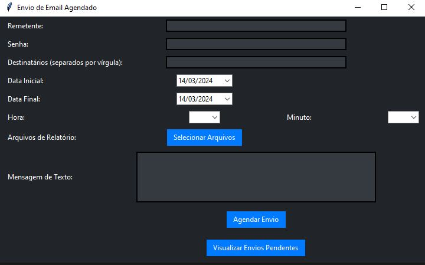
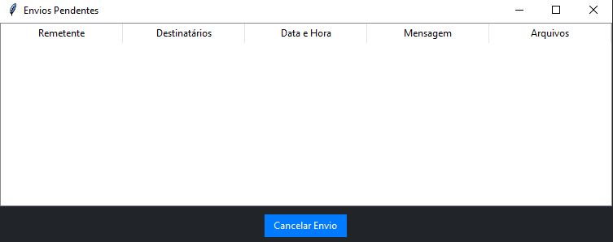
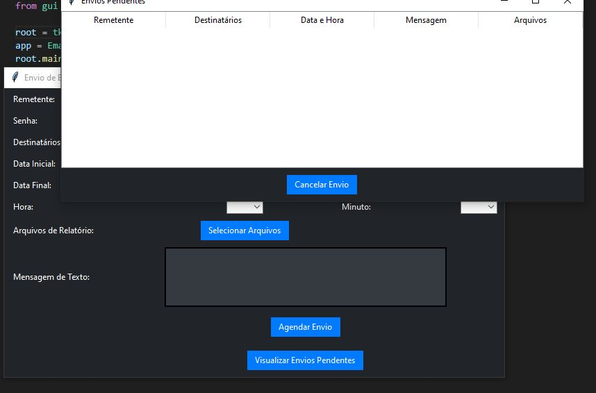

# Envio de Email Agendado

## Descrição do Projeto
Este projeto é uma aplicação Python que permite agendar o envio de e-mails de forma automatizada. A aplicação apresenta uma interface gráfica intuitiva que permite ao usuário configurar detalhes como remetente, destinatários, datas e horários de envio, mensagem de texto e anexos de arquivos. O envio dos e-mails é agendado para a data e hora especificadas pelo usuário.

---

---

## Configuração para Funcionamento com Gmail
Para utilizar o projeto com contas do Gmail, siga os passos abaixo:

1. Ative o acesso a aplicativos menos seguros na sua conta do Gmail seguindo [este link](https://myaccount.google.com/lesssecureapps).
2. Certifique-se de que a autenticação em duas etapas esteja desativada na sua conta do Gmail.
3. Ao usar o projeto pela primeira vez, o Gmail pode bloquear a tentativa de login por considerá-la uma atividade suspeita. Se isso acontecer, você pode receber um e-mail de alerta do Google informando sobre a tentativa de login bloqueada. Basta seguir as instruções no e-mail para permitir o acesso.

---

## Tecnologias Utilizadas
- Python
- Tkinter (para a interface gráfica)
- smtplib (para envio de e-mails)
- email.mime (para criação de e-mails MIME)
- tkcalendar (para a seleção de datas na interface gráfica)

---

Esta aplicação oferece uma maneira conveniente de agendar o envio de e-mails, facilitando a comunicação e automatizando tarefas repetitivas de envio de relatórios, lembretes e outras mensagens programadas.

Para mais informações ou contribuições, sinta-se à vontade para entrar em contato ou enviar pull requests!
